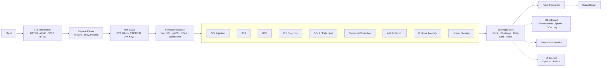

# FortressWAF

[](LICENSE)
[](https://go.dev/)

**Self-hosted WAF for modern APIs.** FortressWAF is a Go reverse proxy that inspects REST, GraphQL, WebSocket, gRPC, and SOAP traffic through a configurable detection pipeline. Configuration is YAML, changes apply at runtime. Single binary, no external dependencies required.

---

## Request Flow



---

## Features

### Core Detection

| Module | What It Detects |
|---|---|
| **SQL Injection** | Tautology, UNION, time-based blind, error-based, stacked queries, encoded variants |
| **Cross-Site Scripting** | Stored, reflected, DOM, event handlers, script tags, obfuscated JS |
| **RCE** | Shell injection, SSTI, EL injection, deserialization, Log4Shell, file inclusion |
| **Path Traversal** | Directory traversal, null bytes, encoding bypass |
| **API Protection** | OpenAPI schema enforcement, shadow API discovery, mass assignment |
| **Protocol Anomaly** | HTTP verb tampering, header smuggling, malformed requests, method override |

### Authentication & Access

| Feature | Implementation |
|---|---|
| **JWT Validation** | JWKS cache, RS256/ES256/HS256, issuer/audience validation, scope check |
| **OAuth 2.0 Introspection** | RFC 7662, token cache, scope and role verification |
| **mTLS** | CA validation, policy OID, certificate info extraction |
| **CAPTCHA** | reCAPTCHA v2/v3, hCaptcha, configurable score threshold |
| **API Key Management** | Bearer token validation against configured keys |

### Traffic & Rate Management

| Feature | Details |
|---|---|
| **Rate Limiting** | Token bucket, leaky bucket, sliding window, fixed window — per-IP, per-route, global |
| **DDoS Protection** | Slow loris detection, slow POST, cache busting, adaptive rate limits |
| **Bot Detection** | Known bot lists, headless browser detection, JS challenge generation |
| **IP Reputation** | TOR/proxy/VPN detection, ASN filtering, CIDR allow/block lists |
| **Session Tracking** | Cookie-based session management with Redis backend |

### Protocol-Specific Inspection

| Protocol | Capabilities |
|---|---|
| **GraphQL** | Query depth limiting, cost analysis, alias count, batch size, field restrictions |
| **WebSocket** | Frame type validation, rate limiting, message size, origin check |
| **gRPC** | Per-service rate limiting, message size limits, content-type detection |
| **SOAP/XML** | XML nesting depth validation, content-type enforcement |

### Credential Protection

- Brute force detection with exponential backoff per IP
- Credential stuffing detection per user hash
- Password spray detection across accounts
- Account lockout with configurable thresholds (attempts, window, duration)
- Login path auto-detection (`/login`, `/auth`, `/signin`)

### Observability

| Tool | Integration |
|---|---|
| **Prometheus** | Metrics endpoint on configurable port/path (requests, latency, decisions, active connections) |
| **Grafana** | Pre-built dashboards for overview, security, compliance, ML |
| **Elasticsearch** | SIEM event export, index templates included |
| **Kibana** | Dashboard definitions for security events and ML anomalies |
| **Splunk** | Event export via HTTP event collector |
| **Health Probes** | `/health`, `/ready`, `/live` endpoints for K8s |

### Content Security

- File upload validation (MIME signatures, extension allow/block lists, magic bytes)
- Response body inspection for data leakage
- Configurable request size limits per endpoint
- HTTP/2 via TLS configuration
- ACME/LetsEncrypt automatic certificate management
- OCSP stapling placeholder

---

## Quick Start

```bash
git clone https://github.com/FortressWAF/FortressWAF.git
cd FortressWAF

# Edit config with your upstream
cp deploy/config.yaml config.yaml

# Run
go run ./cmd/proxy -config config.yaml

# Or use Docker
docker compose -f deploy/docker-compose.yml up -d
```

Minimal config:

```yaml
tls:
  enabled: true
  cert_file: cert.pem
  key_file: key.pem
  http2_enabled: true

admin:
  port: 8444
  api_keys: ["sk-admin"]

sites:
  - name: myapp
    domains: ["app.example.com"]
    upstream: "http://127.0.0.1:3000"
    port: 443
    waf_enabled: true
```

---

## Architecture

Full architecture document: [`docs/architecture.md`](docs/architecture.md)

```
cmd/proxy/           —  WAF server entry point
internal/
  engine/            —  Detection pipeline (18 inspector modules)
  api/               —  Management REST API
  config/            —  YAML config with live reload
  reputation/        —  IP reputation and threat feeds
  ratelimit/         —  Rate limiting algorithms
  session/           —  Session tracking
  siem/              —  SIEM event export
deploy/              —  Docker, Ansible, Terraform, Helm, monitoring
docs/                —  Documentation
dashboard/           —  Web dashboard (Next.js)
ml-engine/           —  ML sidecar (Python/FastAPI)
```

---

## Performance

Measured on 4 vCPU / 8 GB RAM:

| Scenario | Throughput |
|---|---|
| Passthrough (no inspection) | ~85,000 req/s |
| Full rule set | ~40,000 req/s |
| With ML sidecar | Varies by model |

Latency overhead per request: ~200μs average with default rules.

---

## Documentation

| Document | Contents |
|---|---|
| [Getting Started](docs/getting-started.md) | Installation and first config |
| [Architecture](docs/architecture.md) | Pipeline details and deployment modes |
| [Configuration](docs/configuration.md) | Full YAML reference |
| [Rule Language](docs/rule-language.md) | Rule DSL syntax |
| [API Reference](docs/api-reference.md) | REST API docs |
| [Deployment](docs/deployment.md) | Docker, K8s, cloud |
| [Compliance](docs/compliance.md) | PCI-DSS, SOC2, GDPR references |
| [Troubleshooting](docs/troubleshooting.md) | Common issues |

---

## Related Projects

| Repository | Description |
|---|---|
| [fortressctl](https://github.com/FortressWAF/fortressctl) | CLI tool for managing FortressWAF instances |
| [fortresshoneypot](https://github.com/FortressWAF/fortresshoneypot) | Low-interaction HTTP/SSH honeypot |

---

## License

AGPL-3.0
