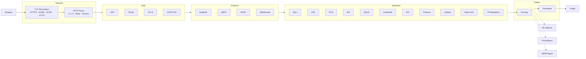

# FortressWAF Architecture

## Overview

FortressWAF operates as a **reverse proxy** that intercepts HTTP/HTTPS traffic, inspects requests through a pipeline, and forwards them to upstream origin servers.

## Proxy Node Pipeline



### Stage 1: TLS Termination

- TLS 1.2 minimum, TLS 1.3 supported
- HTTP/2 via TLS configuration when `http2_enabled: true`
- ACME/LetsEncrypt automatic certificate management via autocert
- mTLS support for API-to-API communication
- OCSP stapling placeholder via VerifyConnection hook

### Stage 2: HTTP Parsing

- HTTP/1.1 support
- URL normalization and path canonicalization
- Body parsing for `application/x-www-form-urlencoded` and `multipart/form-data`
- Header size and count limits enforced
- HTTP/2 supported via TLS configuration; HTTP/3 not currently supported

### Stage 3: Authentication & Access Control

- JWT validation with JWKS caching (RS256, ES256, HS256)
- OAuth 2.0 token introspection (RFC 7662)
- mTLS certificate validation with configurable CA and policy OID
- CAPTCHA verification (reCAPTCHA and hCaptcha)
- API key validation via Bearer token

### Stage 4: Protocol-Specific Inspection

- **GraphQL**: Query depth limiting, cost analysis, alias limit, batch size, restricted fields
- **gRPC**: Per-service rate limiting, message size limits
- **SOAP/XML**: XML nesting depth validation
- **WebSocket**: Frame type validation, rate limiting, origin check

### Stage 5: Detection Pipeline

The detection pipeline runs 11 concurrent inspectors. Each scores the request independently:

| Inspector | What It Checks |
|---|---|
| **SQL Injection** | Tautology, UNION, blind, error-based, stacked queries |
| **XSS** | Stored, reflected, DOM, obfuscated JS |
| **RCE** | Shell, SSTI, EL, deserialization, Log4Shell |
| **API Protection** | Schema enforcement, shadow APIs, mass assignment |
| **Bot Detection** | Known bots, headless browsers, JS challenge |
| **DDoS Protection** | Slow loris, slow POST, cache busting |
| **Protocol Anomaly** | Verb tampering, header smuggling, malformed requests |
| **Upload Security** | MIME validation, magic bytes, extension filtering |
| **Credential Protection** | Brute force, credential stuffing, password spray |
| **Rate Limiting** | Token bucket, leaky bucket, sliding window, fixed window |
| **IP Reputation** | TOR, proxy, VPN, ASN, CIDR allow/block |

Scores accumulate. A block decision from any inspector short-circuits the pipeline. Non-block decisions contribute to a cumulative threat score used by the decision engine.

### Stage 6: Rule Engine

Evaluates requests against a configurable rule set. Each rule specifies:

- Conditions (pattern match, regex, prefix/suffix, CIDR)
- Operators (AND, OR, NOT)
- Actions (block, allow, challenge, log, rate-limit)
- Severity levels (critical, high, medium, low, info)

Available rule phases:
- **Phase 1**: Request headers (User-Agent, Referer, Authorization, Cookies)
- **Phase 2**: Request path and query parameters
- **Phase 3**: Request body

Response inspection is implemented. The `ResponseInspector` middleware wraps the HTTP response writer and captures response bodies for analysis when enabled.

### Stage 7: ML Inference (optional)

The ML sidecar runs as a separate process and provides:

- **Anomaly Scoring**: Scores requests 0.0-1.0 based on deviation from learned baseline
- **Feature Extraction**: Request structure and character distribution features
- **Model**: Single model (not ensemble). Model type depends on configuration.
- **Threshold**: Configurable (default 0.7)
- Training data is static; no continuous learning

### Stage 7: Decision Engine

```
1. If allowlist match → ALLOW
2. If blocklist match → BLOCK (403)
3. If rate limit exceeded → BLOCK (429)
4. If ML score > threshold (configured to block) → BLOCK (403)
5. If rule matches with action=block → BLOCK (403)
6. If rule matches with action=challenge → CHALLENGE
7. Otherwise → ALLOW (forward to upstream)
```

### Stage 8: Proxy Forwarder

- Connection pooling with keep-alive
- Forwards requests to configured upstream
- Response streaming
- No circuit breaker or retry logic

## Data Storage

```
FortressWAF ──► Local filesystem (config files, YAML)
             ──► Redis (rate limit counters, session state, optional)
             ──► PostgreSQL (event storage, optional)
             ──► Splunk / HTTP endpoint / Slack (SIEM export, optional)
```

No built-in database (PostgreSQL, S3, etc.) is required. Config is file-based.

## Dashboard

```
Proxy Node ──WebSocket──► Dashboard (Next.js)
                           - Live metrics
                           - Attack visualization
```

## Deployment Modes

### Reverse Proxy Mode (Default)

```
Client → FortressWAF → Origin Server
```

FortressWAF sits in front of your application. All traffic passes through it.

This is the only currently supported deployment mode. Transparent bridge, sidecar, and API gateway modes are not implemented.

## Performance

Performance varies significantly by hardware, rule count, and configuration. The numbers below are rough estimates from development environments and should not be taken as guaranteed.

| Component | Approximate latency |
|-----------|-------------------|
| TLS termination | ~50μs |
| HTTP parsing | ~20μs |
| Rate limiting (local) | ~10μs |
| IP reputation | ~10μs |
| Rule engine (100 rules) | ~100μs |
| Rule engine (10K rules) | ~2ms |
| ML inference | ~5ms |
